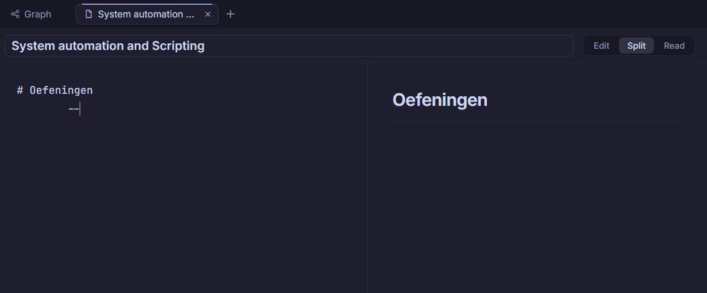
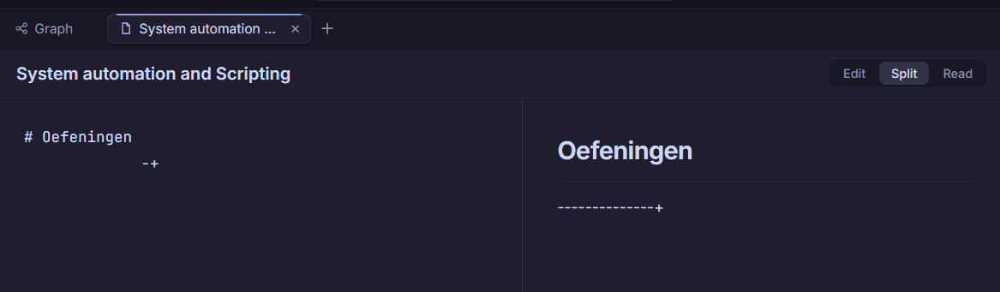
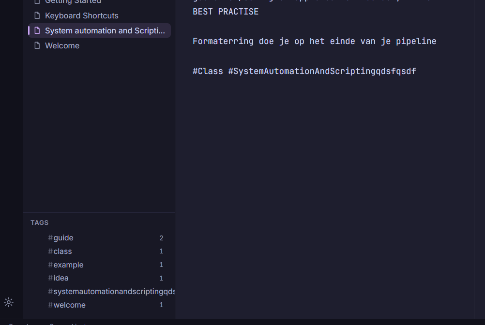

Wanneer je meer dan 2 -- zet dan worden ze onzichtbaar totdat je er een andere character achter zet

Ik krijg de optie om end to end encryptie aan te zetten dit betekent dat notes en vaults automatisch niet geencrpyeerd zijn, PROBLEEM!

Er is geen limiet op tag limiet in de GUI
