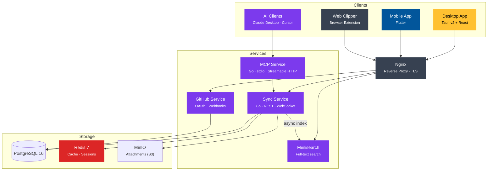
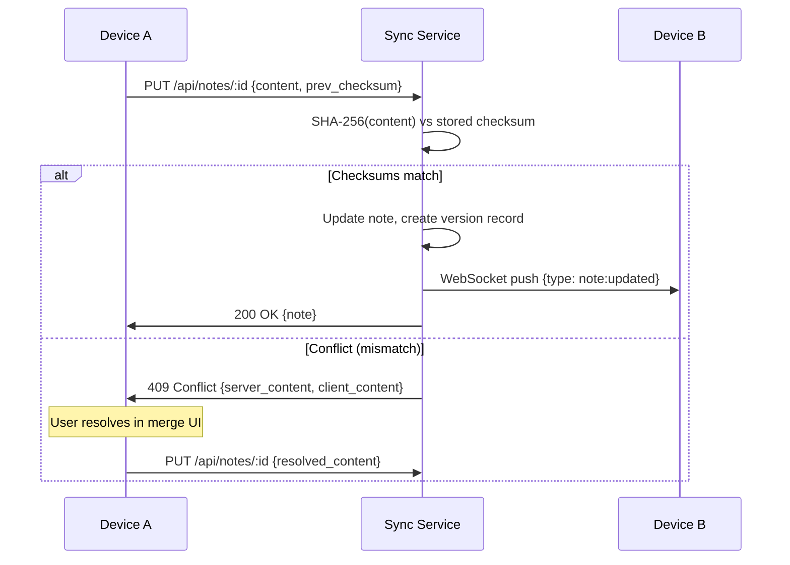
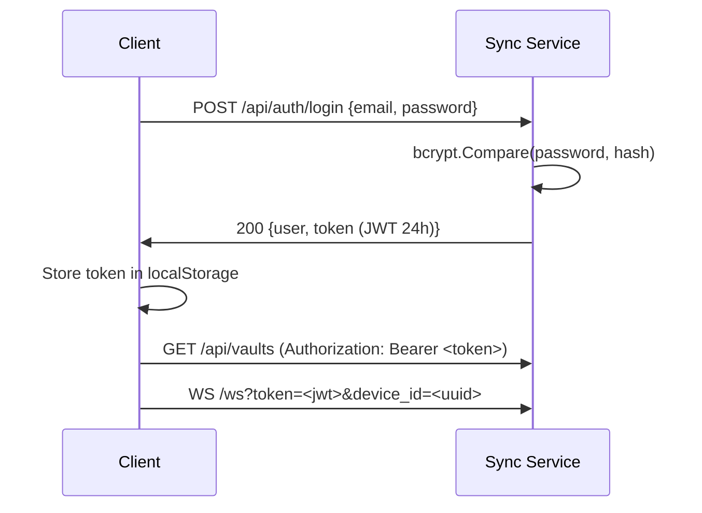
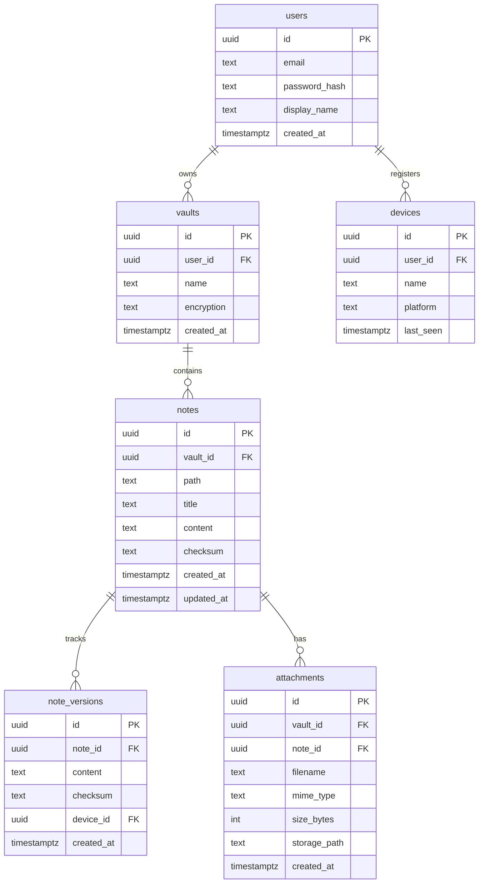

# Architecture — NexusNotes

## System Overview

## Core Components

| Component | Technology | Role |
|---|---|---|
| Sync Service | Go 1.23 | Note storage, versioning, conflict resolution, real-time sync |
| MCP Service | Go 1.23 | AI client access via Model Context Protocol (spec 2025-11-25) |
| Search Service | Meilisearch 1.x | Full-text search, fuzzy matching, tag and folder filters |
| GitHub Service | Go 1.23 | OAuth, repository import, webhook-driven sync |
| Desktop App | Tauri v2 + React + TypeScript | Primary editor — markdown preview, graph view, offline-first |
| Mobile App | Flutter | Mobile editor with simplified graph view |
| Web Clipper | Browser Extension (JS) | Save web pages and selections to a vault |
| Database | PostgreSQL 16 | Structured data (users, vaults, notes, versions) |
| Cache | Redis 7 | Session state, WebSocket sync state, rate limiting |
| Storage | MinIO | S3-compatible attachment storage |
| Proxy | Nginx | TLS termination, routing |

## Data Flows

### Note sync (real-time)

### Search indexing

1. Note created or updated in Sync Service
2. Sync Service publishes an async index task to Meilisearch — does not block the save response
3. Meilisearch indexes title, content, tags, and path; skips content for encrypted vaults
4. Client sends `GET /search?q=&vault=&tag=&date_from=&date_to=` to the Sync Service
5. Sync Service proxies to Meilisearch and returns ranked results with context snippets

> Configure Meilisearch searchable attributes and filterable attributes **before** adding
> documents — changing them after indexing triggers a full reindex.

### Authentication

### Search indexing

1. Note created or updated in Sync Service
2. Sync Service publishes an async index task to Meilisearch — does not block the save response
3. Meilisearch indexes title, content, tags, and path; skips content for encrypted vaults
4. Client sends `GET /search?q=&vault=&tag=&date_from=&date_to=` to the Sync Service
5. Sync Service proxies to Meilisearch and returns ranked results with context snippets

> Configure Meilisearch searchable attributes and filterable attributes **before** adding
> documents — changing them after indexing triggers a full reindex.

## Database Schema

See `services/sync-service/migrations/001_initial_schema.sql` for the full schema.

