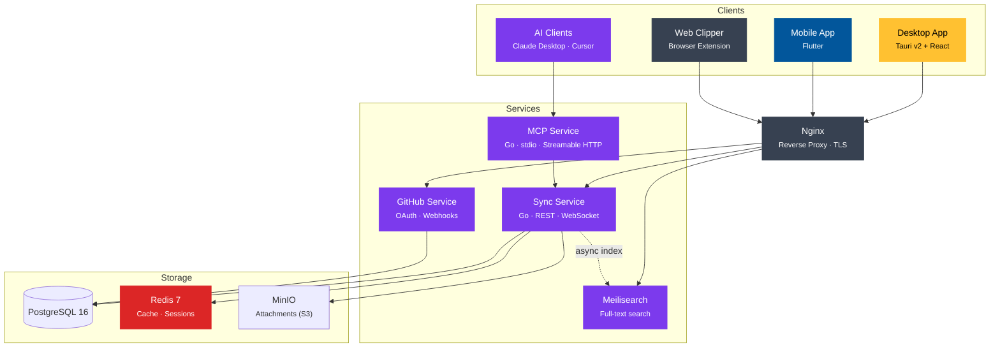
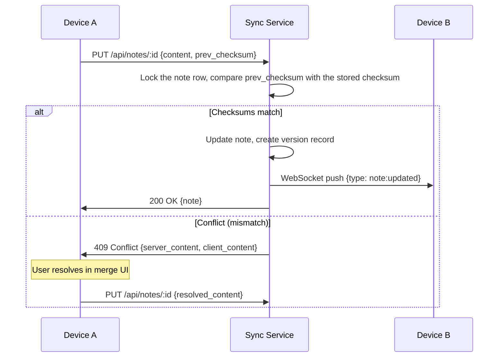
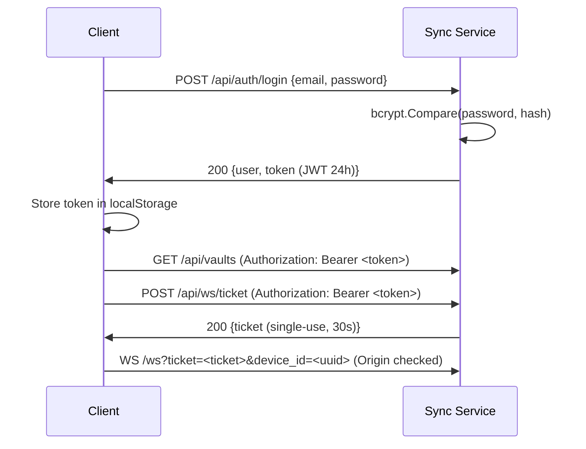
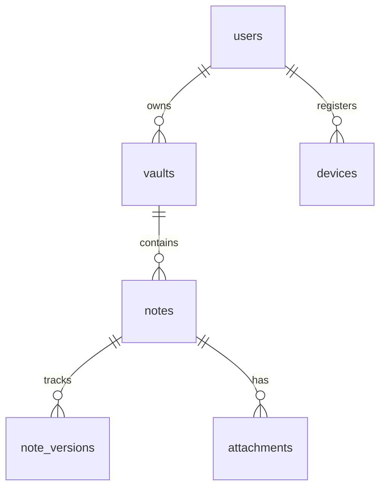

# Architecture — NexusNotes

## System Overview

## Core Components

| Component | Technology | Role |
|---|---|---|
| Sync Service | Go 1.23 | Note storage, versioning, conflict resolution, real-time sync |
| MCP Service | Go 1.23 | AI client access via Model Context Protocol (spec 2025-11-25) |
| Search Service | Meilisearch 1.x | Full-text search, fuzzy matching, tag and folder filters |
| GitHub Service | Go 1.23 | OAuth, repository import, webhook-driven sync |
| Desktop App | Tauri v2 + React + TypeScript | Primary editor — markdown preview, graph view, offline-first |
| Mobile App | Flutter | Mobile editor with simplified graph view |
| Web Clipper | Browser Extension (JS) | Save web pages and selections to a vault |
| Database | PostgreSQL 16 | Structured data (users, vaults, notes, versions) |
| Cache | Redis 7 | Session state, WebSocket sync state, rate limiting |
| Storage | MinIO | S3-compatible attachment storage |
| Proxy | Nginx | TLS termination, routing |

## Data Flows

### Note sync (real-time)

The comparison and the write happen in one database transaction that holds a row lock on
the note. Two devices saving at the same moment with the same previous checksum therefore
queue up: the first wins, and the second sees the new checksum and receives the `409`
instead of silently overwriting the first device's edit. The lock is the weakest one that
serialises writers (it does not block other notes' links from pointing at this note), a
waiting writer gives up after a few seconds instead of piling up, and the whole update runs
on the transaction's own connection so queued requests can never starve it of one.

#### Desktop save pipeline

The desktop client (`desktop/src/lib/useNoteSave.ts`) sends these PUTs one at
a time per note. Every edit bumps a per-note version; a save that completes
after newer edits only adopts the returned checksum, so the note stays
unsaved, its local draft is kept and a follow-up save goes out. Saves that
queue up behind an in-flight one coalesce into a single PUT of the latest
text, based on the checksum the previous save returned. A 409 puts the note
in a "conflict" state that keeps the local text untouched (the merge UI is
tracked in #225); an unreachable server (or a 502/503/504) is retried with
exponential backoff capped at 30 seconds; any other failure is reported in
the status bar and retried on the next edit.

### Search indexing

1. Note created or updated in Sync Service
2. Sync Service publishes an async index task to Meilisearch — does not block the save response
3. Meilisearch indexes title, content, tags, and path; skips content for encrypted vaults
4. Client sends `GET /search?q=&vault=&tag=&date_from=&date_to=` to the Sync Service
5. Sync Service proxies to Meilisearch and returns ranked results with context snippets

> Configure Meilisearch searchable attributes and filterable attributes **before** adding
> documents — changing them after indexing triggers a full reindex.

### Authentication

### Search indexing

1. Note created or updated in Sync Service
2. Sync Service publishes an async index task to Meilisearch — does not block the save response
3. Meilisearch indexes title, content, tags, and path; skips content for encrypted vaults
4. Client sends `GET /search?q=&vault=&tag=&date_from=&date_to=` to the Sync Service
5. Sync Service proxies to Meilisearch and returns ranked results with context snippets

> Configure Meilisearch searchable attributes and filterable attributes **before** adding
> documents — changing them after indexing triggers a full reindex.

## Observability

- **Logging:** all sync-service log lines are structured JSON (`slog`); every
  HTTP request gets a correlation id (inbound `X-Request-ID` honoured, echoed
  in the response) that is stamped on its request log line.
- **Metrics:** `GET /metrics` exposes Prometheus instruments — request count
  and latency by normalized route (ids replaced with `:id`), live WebSocket
  connection gauge, note create/update/delete counters and Go runtime stats.
- **Dashboards:** the compose stack ships Prometheus (scraping every 15s) and
  Grafana with an auto-provisioned NexusNotes dashboard on port 3001.
- **Admin stats:** `GET /api/admin/stats` (static operator token) reports
  user/vault/note totals and uptime.

## Data Model

The relational schema lives in `services/sync-service/migrations/` (source of
truth); docs describe entities and relationships only, deliberately without
column-level detail.

- **users** — account identity and credentials (Argon2id-hashed).
- **vaults** — a user's note collections; each records its encryption mode and,
  for e2ee vaults, an opaque client-written key blob (see encryption.md).
- **notes** — markdown content (ciphertext for e2ee vaults) with a checksum
  used for conflict detection.
- **note_versions** — per-save history for the version-history feature.
- **devices** — registered sync clients and their last-seen time.
- **starred_notes** — per-user favourite marks on notes (which user starred which note, and when).
- **vault_members** — shared-vault membership: which user has which role (viewer/editor) on a vault they don't own.
- **attachments** — file metadata; bytes live in MinIO.
