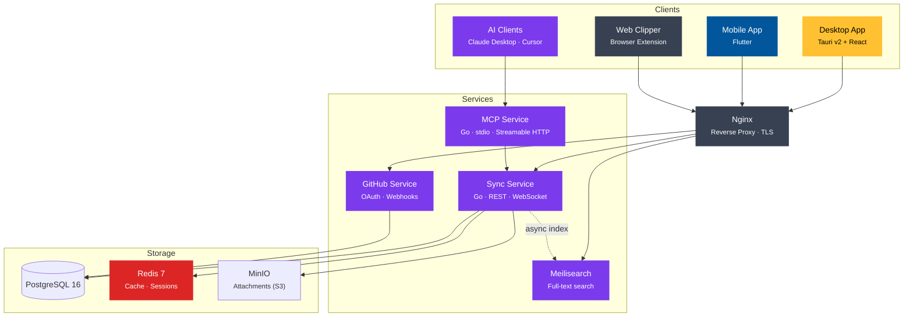
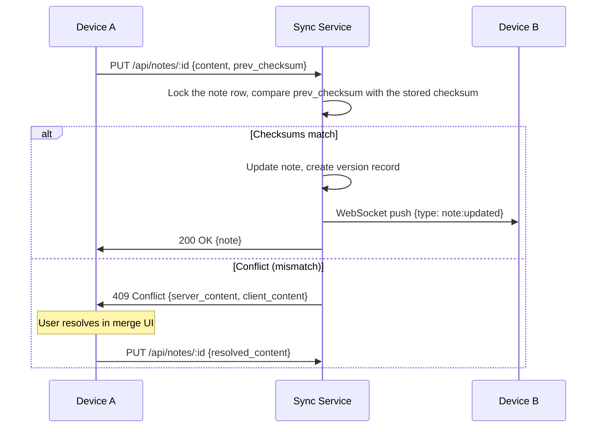
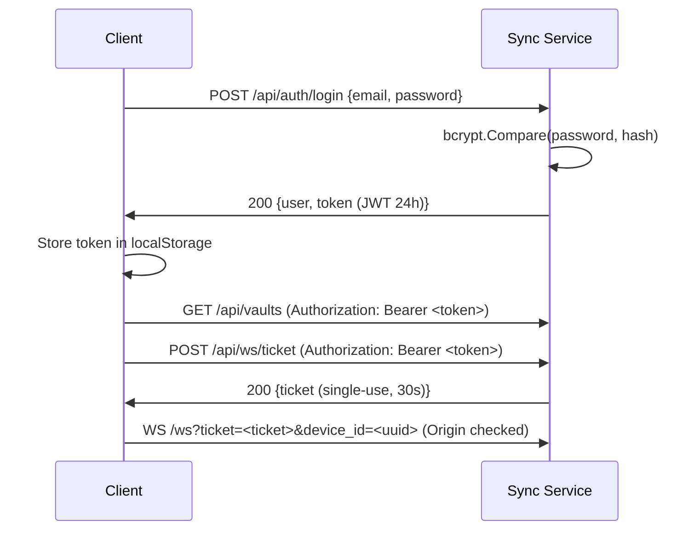
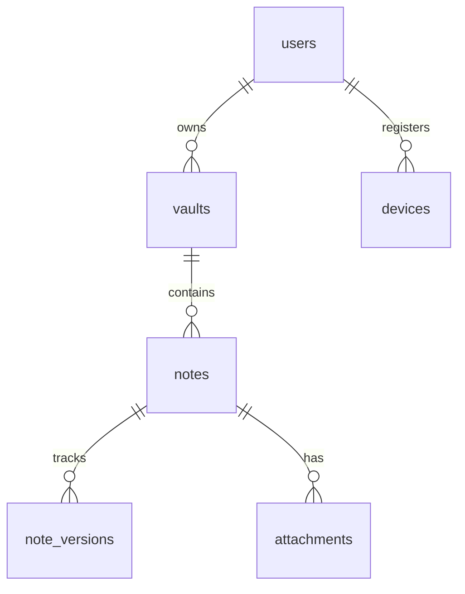

# Architecture — NexusNotes

## System Overview

```mermaid
graph TB
    subgraph Clients
        DESK["Desktop App<br/><small>Tauri v2 + React</small>"]
        MOB["Mobile App<br/><small>Flutter</small>"]
        CLIP["Web Clipper<br/><small>Browser Extension</small>"]
        AI["AI Clients<br/><small>Claude Desktop · Cursor</small>"]
    end

    NGINX["Nginx<br/><small>Reverse Proxy · TLS</small>"]

    subgraph Services
        SYNC["Sync Service<br/><small>Go · REST · WebSocket</small>"]
        MCP["MCP Service<br/><small>Go · stdio · Streamable HTTP</small>"]
        SEARCH["Meilisearch<br/><small>Full-text search</small>"]
        GH["GitHub Service<br/><small>OAuth · Webhooks</small>"]
    end

    subgraph Storage
        PG[("PostgreSQL 16")]
        REDIS["Redis 7<br/><small>Cache · Sessions</small>"]
        MINIO["MinIO<br/><small>Attachments (S3)</small>"]
    end

    DESK & MOB & CLIP --> NGINX
    AI --> MCP
    NGINX --> SYNC & SEARCH & GH
    SYNC --> PG & REDIS & MINIO
    SYNC -.->|"async index"| SEARCH
    MCP --> SYNC
    GH --> PG

    style DESK fill:#ffc131,stroke:#ffc131,color:#000
    style MOB fill:#02569b,stroke:#02569b,color:#fff
    style CLIP fill:#374151,stroke:#374151,color:#fff
    style AI fill:#7c3aed,stroke:#7c3aed,color:#fff
    style SYNC fill:#7c3aed,stroke:#7c3aed,color:#fff
    style MCP fill:#7c3aed,stroke:#7c3aed,color:#fff
    style SEARCH fill:#7c3aed,stroke:#7c3aed,color:#fff
    style GH fill:#7c3aed,stroke:#7c3aed,color:#fff
    style NGINX fill:#374151,stroke:#374151,color:#fff
    style REDIS fill:#dc2626,stroke:#dc2626,color:#fff
```

## Core Components

| Component | Technology | Role |
|---|---|---|
| Sync Service | Go 1.23 | Note storage, versioning, conflict resolution, real-time sync |
| MCP Service | Go | AI client access via Model Context Protocol — *planned, after 1.0* |
| Search Service | Meilisearch 1.x | Full-text search, fuzzy matching, tag and folder filters |
| GitHub Service | Go | OAuth, repository import, webhook-driven sync — *planned, after 1.0* |
| Desktop App | Tauri v2 + React + TypeScript | Primary editor — markdown preview, graph view, offline-first |
| Mobile App | Flutter | Mobile editor with simplified graph view — *planned, after 1.0* |
| Web Clipper | Browser Extension (JS) | Save web pages and selections to a vault — *planned, after 1.0* |
| Database | PostgreSQL 16 | Structured data (users, vaults, notes, versions) |
| Cache | Redis 7 | Part of the stack but not used by the sync service yet: sessions, WebSocket state and rate limits are in-process (one instance, see Real-time Sync) |
| Storage | MinIO | S3-compatible attachment storage |
| Proxy | Nginx | TLS termination, routing |

## Data Flows

### Note sync (real-time)

```mermaid
sequenceDiagram
    participant A as Device A
    participant S as Sync Service
    participant B as Device B

    A->>S: PUT /api/notes/:id {content, prev_checksum}
    S->>S: Lock the note row, compare prev_checksum with the stored checksum
    alt Checksums match
        S->>S: Update note, create version record
        S->>B: WebSocket push {type: note:updated}
        S->>A: 200 OK {note}
    else Conflict (mismatch)
        S->>A: 409 Conflict {server_content, client_content}
        Note over A: User resolves in merge UI
        A->>S: PUT /api/notes/:id {resolved_content}
    end
```

Every save records the note's new text in its history. Like Obsidian's file
recovery, a version is a snapshot: saves from the device that started it keep
updating it for 5 minutes (#413), so autosave every second does not fill the
history with near-identical copies. A save from another device, or after the
window, starts a new version; so does restoring a version (#417), which the
server does by copying the stored version back, so the text it replaces is
kept. How much history a vault keeps is the owner's choice (#418): the newest N
versions of each note (50 by default) and, optionally, nothing older than D
days, but always a note's newest version. It is applied when a new version is
stored, when the setting changes, and by the daily cleanup.

The comparison and the write happen in one database transaction that holds a row lock on
the note. Two devices saving at the same moment with the same previous checksum therefore
queue up: the first wins, and the second sees the new checksum and receives the `409`
instead of silently overwriting the first device's edit. The lock is the weakest one that
serialises writers (it does not block other notes' links from pointing at this note), a
waiting writer gives up after a few seconds instead of piling up, and the whole update runs
on the transaction's own connection so queued requests can never starve it of one.

#### Desktop save pipeline

The desktop client (`desktop/src/lib/useNoteSave.ts`) sends these PUTs one at
a time per note. Every edit bumps a per-note version; a save that completes
after newer edits only adopts the returned checksum, so the note stays
unsaved, its local draft is kept and a follow-up save goes out. Saves that
queue up behind an in-flight one coalesce into a single PUT of the latest
text, based on the checksum the previous save returned. A 409 puts the note
in a "conflict" state that keeps the local text untouched (see *Resolving a
conflict* below); an unreachable server (or a 502/503/504) is retried with
exponential backoff capped at 30 seconds; any other failure is reported in
the status bar and retried on the next edit.

A retry resends the failed request's text unless the user typed since, and
reopening a note shows any text the server hasn't confirmed (e2ee notes have
no local draft). The server pushes `note:updated` to every client, the saving
one included, before it answers the PUT. The client therefore remembers the
checksums of its own recent uploads: a push matching one of them (or the
version the local text is based on) is merged, while any other push for a
note with unsaved text marks it as a conflict and leaves the local text and
base checksum untouched. A push from another device for the open note while
it has no unsaved text replaces the editor's text, so the next edit builds on
that version instead of silently saving over it. The open note only moves to
that version once the editor shows it; a keystroke in between turns it into a
conflict. While no editor is on screen (the graph view) it takes the version
at once, as long as the note is still saved and its text unchanged. The editor
always starts from the app's text for the open note, unsaved edits included. An e2ee push that cannot be decrypted never reaches the open note. Signing out drops every queued save, retry and in-flight result.

Closing a tab or the window with unsaved text (the close button, or an
OS-level close in the native app) never closes until the server has
confirmed the save. If the save fails, the close dialog stays open, explains
why (offline, conflict or another error) and offers retry, keep editing, or
an explicit close without saving.

#### Resolving a conflict

The 409 body carries the server's content and checksum, and a conflicting
push carries the other device's version, so the save hook keeps that
version per note (decrypted first for e2ee vaults; if it can't be read, no
comparison is offered). While the open note is in conflict, a notice above
the editor opens a side-by-side comparison: a line diff of both versions
with long unchanged stretches folded away. The user keeps their text, takes
the other device's, or merges by hand, starting from a draft that holds
every difference between Git-style conflict markers. The chosen text is
saved with the other device's checksum as its previous checksum, so a change
made elsewhere in the meantime produces a fresh conflict instead of being
overwritten; taking the other version as it is needs no save. Each choice
names the version of the other device it was made against: if a newer one
arrived while the dialog was open (a merge started from an older version, or
a push just before the click), nothing is saved and the dialog shows the
newest version instead. A 409 for a save sent before the resolution is
ignored.

### Search indexing

1. Note created or updated in Sync Service
2. Sync Service queues the index update for its indexing worker — the save response never waits.
   The worker sends updates in order, retries a failed call up to 4 times with backoff
   (not for a request Meilisearch rejects as invalid), and the queue is drained on
   shutdown (#401)
3. Meilisearch indexes title, content, tags, and path; skips content for encrypted vaults
4. Client sends `GET /search?q=&vault=&tag=&date_from=&date_to=` to the Sync Service
5. Sync Service proxies to Meilisearch and returns ranked results with context snippets
6. The index is derived data: when the Sync Service starts with an empty index it
   rebuilds it from the database in the background (#365)
7. Without Meilisearch the Sync Service falls back to its own search: titles, tags and
   aliases are matched in PostgreSQL, note content after decrypting it in the service
   (content is encrypted at rest, so the database cannot match it)

> Configure Meilisearch searchable attributes and filterable attributes **before** adding
> documents — changing them after indexing triggers a full reindex.

### Authentication

```mermaid
sequenceDiagram
    participant C as Client
    participant S as Sync Service

    C->>S: POST /api/auth/login {email, password}
    S->>S: bcrypt.Compare(password, hash)
    S->>C: 200 {user, token (JWT 24h)}
    C->>C: Store token in localStorage
    C->>S: GET /api/vaults (Authorization: Bearer <token>)
    C->>S: POST /api/ws/ticket (Authorization: Bearer <token>)
    S->>C: 200 {ticket (single-use, 30s)}
    C->>S: WS /ws?ticket=<ticket>&device_id=<uuid> (Origin checked)
```

### Search indexing

1. Note created or updated in Sync Service
2. Sync Service queues the index update for its indexing worker — the save response never waits.
   The worker sends updates in order, retries a failed call up to 4 times with backoff
   (not for a request Meilisearch rejects as invalid), and the queue is drained on
   shutdown (#401)
3. Meilisearch indexes title, content, tags, and path; skips content for encrypted vaults
4. Client sends `GET /search?q=&vault=&tag=&date_from=&date_to=` to the Sync Service
5. Sync Service proxies to Meilisearch and returns ranked results with context snippets
6. The index is derived data: when the Sync Service starts with an empty index it
   rebuilds it from the database in the background (#365)
7. Without Meilisearch the Sync Service falls back to its own search: titles, tags and
   aliases are matched in PostgreSQL, note content after decrypting it in the service
   (content is encrypted at rest, so the database cannot match it)

> Configure Meilisearch searchable attributes and filterable attributes **before** adding
> documents — changing them after indexing triggers a full reindex.

## Observability

- **Logging:** all sync-service log lines are structured JSON (`slog`); every
  HTTP request gets a correlation id (inbound `X-Request-ID` honoured, echoed
  in the response) that is stamped on its request log line.
- **Health:** `GET /health` is liveness (process up, build version);
  `GET /ready` is readiness (database reachable) and backs the image's Docker
  `HEALTHCHECK`.
- **Metrics:** `GET /metrics`, on its own `METRICS_ADDR` listener only, exposes Prometheus instruments — request count
  and latency by normalized route (ids replaced with `:id`), live WebSocket
  connection gauge, note create/update/delete counters and Go runtime stats.
- **Dashboards:** the compose stack ships Prometheus (scraping every 15s) and
  Grafana with an auto-provisioned NexusNotes dashboard on port 3001.
- **Admin stats:** `GET /api/admin/stats` (static operator token) reports
  user/vault/note totals and uptime.

## Real-time Sync (WebSocket hub)

- Each connected device holds one WebSocket; the hub fans note and vault events
  out to every device of the vault's owner and members.
- A device whose send buffer is full is disconnected rather than silently
  missing an update (#388). Every reconnect makes the app reload the vault list
  and the active vault's notes, since pushes sent while it was offline are not
  replayed.
- The hub lives in one sync-service process: run a single instance. Several
  instances behind a load balancer would only reach the devices connected to
  each one (a shared pub/sub, e.g. Redis, would be needed first).

## Timeouts and Shutdown

- **Timeouts:** ordinary API calls run under the server-wide 15 s read and write
  timeouts. Long transfers set their own (#332): account export and attachment
  upload/download get 2 min to read the request and 5 min to write the response,
  and the linked-file proxy 45 s to respond (its own fetch may take 15 s).
- **Shutdown:** on SIGINT/SIGTERM the WebSocket hub first sends every client a
  `1001 going away` close frame and stops accepting connections; clients that do
  not answer within a second are disconnected. The metrics listener and the HTTP
  server then drain within the 10 s shutdown budget (#332).

## Data Model

The relational schema lives in `services/sync-service/migrations/` (source of
truth); docs describe entities and relationships only, deliberately without
column-level detail.

```mermaid
erDiagram
    users ||--o{ vaults : owns
    vaults ||--o{ notes : contains
    notes ||--o{ note_versions : tracks
    notes ||--o{ attachments : has
    users ||--o{ devices : registers
```

- **users** — account identity and credentials (Argon2id-hashed).
- **vaults** — a user's note collections; each records its encryption mode and,
  for e2ee vaults, an opaque client-written key blob (see encryption.md).
- **notes** — markdown content (ciphertext for e2ee vaults) with a checksum
  used for conflict detection.
- **note_versions** — snapshots of a note over time for the version history
  (one per device per 5 minutes of editing).
- **devices** — registered sync clients and their last-seen time.
- **starred_notes** — per-user favourite marks on notes (which user starred which note, and when).
- **vault_members** — shared-vault membership: which user has which role (viewer/editor) on a vault they don't own.
- **attachments** — file metadata; bytes live in MinIO.
