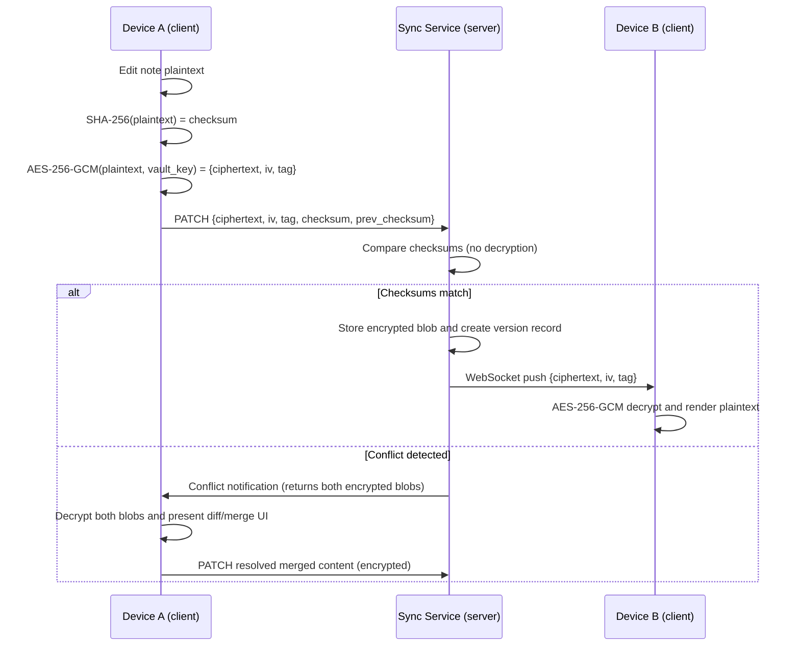

# Encryption Design - NexusNotes

This document defines the end-to-end encryption (E2EE) model for NexusNotes.
The server stores only opaque ciphertext. It is mathematically infeasible for
any party, including the server operator, to read note content without the
user's passphrase.

---

## Distinction between hashing and encryption

Hashing is a one-way transformation; the original data cannot be recovered.
Encryption is a two-way transformation; the owner holding the correct key can
always decrypt. Notes require encryption, not hashing.

SHA-256 hashing is used only for conflict detection checksums computed from
plaintext before encryption. It is not used to protect note content.

---

## Threat model

| Threat | Protected |
|---|---|
| Database breach - attacker reads PostgreSQL dump | Yes - only ciphertext is stored |
| Server operator access to stored data | Yes - server never holds the decryption key |
| Network interception | Yes - TLS in transit plus content encrypted at rest |
| Attacker with physical device access while vault is locked | Yes - key is held in memory only while vault is unlocked |
| User loses vault passphrase | Recoverable **only** with the one-time recovery key issued at setup; without both, data is unrecoverable — zero-knowledge means no backdoor |
| Weak passphrase and offline brute force | Mitigated by Argon2id (intentionally slow key derivation) |

---

## Encryption model - per-vault opt-in

Vaults are either Standard (plaintext, existing behaviour) or Encrypted (E2EE).
The user selects the encryption mode at vault creation time. Standard vaults
are unaffected.

```
vaults.encryption = 'none'  -> existing behaviour, no change
vaults.encryption = 'e2ee'  -> all note content encrypted before upload
```

---

## Key hierarchy

```
User passphrase                       Recovery key (random 256-bit,
       |                              shown once as a base32 code)
       v  Argon2id(passphrase, salt)         |
  Master Key  (256-bit; never stored;        |
  held in memory only)                       |
       |                                     |
       v  AES-256-GCM wrap                   v  AES-256-GCM wrap
  Vault Key   (random 256-bit; stored on the server ONLY in wrapped form,
  once under the Master Key and once under the recovery key)
       |
       v  AES-256-GCM encrypt (unique IV per note per save)
  Note ciphertext  (stored in the database)
```

### Rationale for two key levels

When the user changes their passphrase, only the Vault Key needs to be
re-wrapped using the new Master Key. Without this indirection, a passphrase
change would require re-encrypting every note, which is both expensive and
introduces failure risk.

### Recovery key (backup code)

When encryption is enabled, the client generates a random 256-bit recovery
key and shows it exactly once as a human-readable grouped base32 code with a
"save or print this" prompt. The Vault Key is wrapped a second time under
this recovery key, and only that wrapped blob is uploaded — the recovery key
itself never reaches the server.

Recovery flow: enter the recovery key → unwrap the Vault Key → set a new
passphrase (re-wrap under the new Master Key) → a **fresh** recovery key is
generated and shown, and the old recovery wrap is replaced. Losing both the
passphrase and the recovery key makes the vault permanently unreadable; the
setup UI states this in plain words.

---

## Cryptographic primitives

| Operation | Algorithm | Rationale |
|---|---|---|
| Key derivation | Argon2id (t=3, m=65536 / 64 MiB, p=4) | Memory-hard; resistant to GPU and ASIC brute-force attacks. Exceeds OWASP minimum (m=19456, t=2, p=1) — deliberate for vault unlock, which happens infrequently |
| Symmetric encryption | AES-256-GCM | Authenticated encryption; detects ciphertext tampering |
| IV / nonce | 12-byte random value per save | IVs must never be reused with the same key |
| Conflict detection checksum | SHA-256 of plaintext computed before encryption | Allows server-side conflict detection without content access |
| Salt | 16-byte random value per vault | Generated once and stored in the `vaults` table |

---

## Server-side storage

The vault record carries the encryption mode (standard or e2ee) plus a single
opaque, client-written key-material blob. The server never interprets that
blob -- it stores and returns it verbatim. (Schema details live in the
migrations, not in the docs.)

The key-material blob carries everything the client needs to unlock, versioned
so parameters and algorithms can be migrated later:

```json
{
  "version": 1,
  "kdf": { "algo": "argon2id", "m": 19456, "t": 2, "p": 1, "salt": "<b64>" },
  "wrapped_key": { "iv": "<b64>", "data": "<b64>" },
  "recovery_wrapped_key": { "iv": "<b64>", "data": "<b64>" }
}
```

Note storage is unchanged: for e2ee vaults the regular content field stores
the payload `base64(iv):base64(ciphertext+tag)` produced by the
client (`src/lib/crypto.ts` `encryptNote`). The stored checksum is the
client-computed SHA-256 of the *plaintext* verbatim — the server cannot (and
must not) recompute it, and conflict detection keeps working because the same
plaintext yields the same checksum. For standard vaults client checksums are
still never trusted.

---

## Sync flow for encrypted vaults

```
1. User edits a note on Device A.
2. Client computes SHA-256(plaintext) to obtain the conflict checksum.
3. Client encrypts: AES-256-GCM(plaintext, vault_key, random_iv) producing {ciphertext, tag}.
4. Client sends PATCH /notes/:id with:
     { encrypted_content, content_iv, content_tag, conflict_checksum, prev_checksum }
5. Server receives an opaque blob, stores it, and never decrypts it.
6. Server compares conflict_checksum to prev_checksum for conflict detection (no content access required).
7. On match: a version record is created and the encrypted blob is pushed to Device B via WebSocket.
8. Device B decrypts the blob using its in-memory vault_key and renders the note.
```



---

## Client-side search for encrypted vaults

Meilisearch cannot index encrypted content. For encrypted vaults, search runs
entirely within the desktop application.

- On vault unlock, the client decrypts the full note list into memory (React
  state only ever holds plaintext; ciphertext exists on the wire and server).
- Search (`src/lib/clientSearch.ts`) runs a linear scan over those decrypted
  notes with title-first ranking, tag filtering and HTML-escaped snippets --
  mirroring the server search result shape so the UI renders both identically.
  No external index library (MiniSearch/FlexSearch) is used: at personal-vault
  scale a scan over in-memory strings is instant, and it avoids keeping a
  second plaintext copy in an index structure. Swap in MiniSearch later if
  fuzzy matching becomes a requirement.
- Search queries execute in the client process with no network calls and no server
  involvement.
- Nothing search-related is ever persisted to disk in unencrypted form.

Client-side search is slightly slower for very large vaults (10,000 or more notes)
compared to server-side Meilisearch. For typical personal vaults this difference
is imperceptible.

---

## What the server can observe for encrypted vaults

| Field | Visible to server | Notes |
|---|---|---|
| Note title | Yes (plaintext) | Stored plaintext; used for sidebar rendering |
| Note path and folder | Yes (plaintext) | Required for file tree structure |
| Tags | Yes (plaintext) | Required for filtering |
| Note content | No (ciphertext only) | |
| SHA-256 checksum | Yes | Reveals nothing about content |
| Approximate file size | Yes | Ciphertext length approximates plaintext length |
| Timestamps | Yes | Created at and updated at |

If the title, path, or tags are also considered sensitive, use generic identifiers
and omit tags. A future "full stealth" mode could encrypt metadata as well, at the
cost of server-side file tree functionality.

---

## Passphrase change flow

```
1. User provides the old passphrase and the new passphrase.
2. Client derives: old_master_key = Argon2id(old_passphrase, salt)
3. Client decrypts: vault_key = AES-256-GCM-Decrypt(wrapped_vault_key, old_master_key)
4. Client derives: new_master_key = Argon2id(new_passphrase, same_salt)
5. Client re-wraps: new_wrapped_vault_key = AES-256-GCM(vault_key, new_master_key)
6. Client sends PATCH /vaults/:id/key { new_wrapped_vault_key, new_vault_key_iv }
7. All existing note ciphertexts remain unchanged; only the wrapped key changes.
```

---

## Implementation notes

- Use the Web Crypto API (`crypto.subtle`) for AES-256-GCM, SHA-256 and
  randomness — native and fast. **Argon2id is not part of Web Crypto**; use the
  audited, dependency-free `@noble/hashes` implementation for key derivation.
- Never transmit the Master Key to the server and never write it to disk.
- Hold the Vault Key in memory for the session duration; clear it on lock or logout.
- Provide a "Lock vault" button that clears the Vault Key from memory and requires
  passphrase re-entry to resume.
- Store Argon2id parameters in the `kdf_params` JSON column so you can increase them
  in future releases without breaking existing vaults.
- If you increase the Argon2id parameters in a future release, derive the new Master Key
  on the user's next unlock, re-wrap the Vault Key, and persist the new `kdf_params` —
  all existing note ciphertexts remain valid.

---

## References

- [Standard Notes Encryption Architecture](https://standardnotes.com/help/21/what-encryption-does-standard-notes-use)
- [Web Crypto API — AES-GCM (MDN)](https://developer.mozilla.org/en-US/docs/Web/API/SubtleCrypto/encrypt)
- [Argon2id — RFC 9106](https://www.rfc-editor.org/rfc/rfc9106)
- [OWASP Password Storage Cheat Sheet — Argon2id recommended parameters](https://cheatsheetseries.owasp.org/cheatsheets/Password_Storage_Cheat_Sheet.html)
- [OWASP Cryptographic Storage Cheat Sheet](https://cheatsheetseries.owasp.org/cheatsheets/Cryptographic_Storage_Cheat_Sheet.html)
