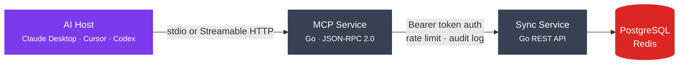

# MCP Server Design - NexusNotes

This document defines the NexusNotes Model Context Protocol (MCP) server. It lets
Claude, Codex, Cursor, and any MCP-compatible AI client read, search, create, and update
your notes — with the same authentication and security model as the desktop application.

---

## What is MCP?

The Model Context Protocol (published by Anthropic as an open standard, current spec
version **2025-11-25**) is a JSON-RPC 2.0 protocol that provides a standardised interface
between AI models and external data sources. Rather than every AI tool building a bespoke
integration, MCP defines a universal contract for **tools**, **resources**, and **prompts**.



---

## Architecture

The MCP server runs as a separate Go service (`services/mcp-service/`) alongside the
existing sync service, built on the official
[`modelcontextprotocol/go-sdk`](https://github.com/modelcontextprotocol/go-sdk).
It supports two transport modes:

- **stdio** — for local use via Claude Desktop or similar clients on the same machine
- **Streamable HTTP** — the spec-recommended remote transport for Cursor, web agents, and
  CI pipelines; replaces the older SSE-only transport

The service authenticates via named API tokens rather than user passwords, and logs every
AI action to a persistent audit log. It is fully optional — the application operates
normally without it.

### Transport modes

| Mode | Use case | Configuration |
|---|---|---|
| `stdio` | Local — AI client on the same machine | JSON snippet in `claude_desktop_config.json` |
| `Streamable HTTP` | Remote — Cursor, web agents, CI pipelines | Bearer token, same self-hosted Docker stack |

> **Why Streamable HTTP over SSE?** The MCP spec 2025-11-25 designates Streamable HTTP as
> the primary remote transport. It runs over ordinary HTTP POST/GET, scales horizontally
> without sticky sessions, and supports both streaming and stateless request patterns.

---

## Authentication and token model

AI clients authenticate with named MCP tokens — not your login password.

- Generate tokens in **Settings > AI Access**
- Each token has a human-readable name (for example, "Claude Desktop" or "Work Cursor") and a scope:
  - `read` — list and read notes only
  - `read-write` — also create, update, and delete notes
- Token values are shown once on creation and stored as a bcrypt hash in the database
- Revoke tokens at any time from the settings page
- Every MCP call is recorded: `token_id`, `tool_name`, `timestamp`, `args_summary`

```sql
CREATE TABLE mcp_tokens (
    id           UUID PRIMARY KEY DEFAULT gen_random_uuid(),
    user_id      UUID NOT NULL REFERENCES users(id),
    name         TEXT NOT NULL,
    token_hash   TEXT NOT NULL,       -- bcrypt(token)
    scopes       TEXT[] NOT NULL,     -- ['read'] or ['read', 'write']
    last_used_at TIMESTAMPTZ,
    created_at   TIMESTAMPTZ NOT NULL DEFAULT now()
);

CREATE TABLE mcp_audit_log (
    id           BIGSERIAL PRIMARY KEY,
    token_id     UUID NOT NULL REFERENCES mcp_tokens(id),
    tool         TEXT NOT NULL,
    args_summary JSONB,               -- sanitised; paths and IDs only, no content
    created_at   TIMESTAMPTZ NOT NULL DEFAULT now()
);
```

---

## Tools exposed to AI clients

Tools are callable functions — each has a name, a description, a JSON Schema input
definition, and returns a structured result.

### Read tools (available on `read` scope)

| Tool | Description | Key parameters |
|---|---|---|
| `list_vaults` | List all vaults accessible to the token | none |
| `list_notes` | List notes in a vault or folder; returns title, path, tags, updated_at — never returns content | `vault_id`, `folder` (optional), `limit`, `cursor` |
| `read_note` | Read the full content of a note by path or ID | `vault_id`, `path` or `note_id` |
| `search_notes` | Full-text search across a vault | `vault_id`, `q`, `tags` (optional), `date_from` (optional), `date_to` (optional) |
| `get_backlinks` | Return all notes that link to a given note | `note_id` |
| `get_graph` | Return graph nodes and edges for a vault | `vault_id` |
| `list_tags` | Return all tags in a vault with note counts | `vault_id` |
| `get_daily_note` | Get or create the daily note for today | `vault_id` |

### Write tools (require `write` scope)

| Tool | Description | Key parameters |
|---|---|---|
| `create_note` | Create a new note | `vault_id`, `path`, `content`, `tags` (optional) |
| `update_note` | Replace or patch note content | `vault_id`, `note_id`, `content`, `mode`: `replace`, `append`, or `prepend` |
| `append_to_note` | Append a text block to an existing note — non-destructive | `vault_id`, `note_id`, `text` |
| `delete_note` | Soft-delete a note | `vault_id`, `note_id`, `confirm: true` |

> **Why `confirm: true` on delete?** It forces the AI to pass an explicit safety parameter,
> preventing accidental deletion from ambiguous instructions.

---

## Resources exposed to AI clients

Resources let AI clients browse your vault structure by URI without invoking tools.
Clients that implement `resources/list` and `resources/read` — like Claude Desktop — can
navigate the vault tree the same way you use the sidebar.

```
nexusnotes://vault/{vault_id}/                   -> vault root listing
nexusnotes://vault/{vault_id}/note/{path}        -> note content
nexusnotes://vault/{vault_id}/canvas/{canvas_id} -> canvas data
nexusnotes://vault/{vault_id}/tags               -> tag list
```

---

## Prompts exposed to AI clients

Prompts are reusable, server-defined message templates. AI clients retrieve them via
`prompts/list` and invoke them with typed arguments via `prompts/get` — the server
returns a ready-to-send messages array. You use prompts for common vault workflows that
benefit from structured context rather than ad-hoc tool calls.

| Prompt | Description | Arguments |
|---|---|---|
| `summarize_note` | Summarise the content of a note in 2–3 sentences | `vault_id`, `note_id` |
| `extract_tasks` | Extract all action items from a note as a markdown checklist | `vault_id`, `note_id` |
| `daily_reflection` | Generate a daily reflection prompt from the current day's notes | `vault_id` |
| `find_connections` | Identify thematic connections between two notes | `vault_id`, `note_id_a`, `note_id_b` |

---

## Encrypted vaults and AI access

Zero-knowledge (E2EE) vaults cannot be decrypted by the MCP server — by design.

| Vault type | AI can read content | AI can search content |
|---|---|---|
| Standard (`encryption: none`) | Yes | Yes, via Meilisearch |
| Encrypted (`encryption: e2ee`) | No — returns encrypted blob and metadata only | Partial — title, path, and tags only via client-side index |

> This is a feature, not a limitation. You can maintain a mixed vault setup: standard
> vaults for notes you are comfortable sharing with AI, and encrypted vaults for sensitive
> material. The AI simply cannot see what you have locked.

---

## Desktop integration — "Copy MCP config" button

The settings page generates a ready-to-paste configuration snippet for popular AI clients.

### Claude Desktop (`claude_desktop_config.json`)

```json
{
  "mcpServers": {
    "nexusnotes": {
      "command": "nexusnotes-mcp",
      "args": ["--token", "nn_YOUR_TOKEN_HERE"],
      "env": {}
    }
  }
}
```

### Cursor / HTTP mode

```json
{
  "mcp": {
    "nexusnotes": {
      "url": "http://localhost:8081/mcp",
      "headers": {
        "Authorization": "Bearer nn_YOUR_TOKEN_HERE"
      }
    }
  }
}
```

---

## Rate limiting

Limits are enforced using a Redis sliding window counter per token.

| Scope | Limit |
|---|---|
| Read tools | 120 calls per minute per token |
| Write tools | 30 calls per minute per token |
| `delete_note` | 5 calls per minute per token |

---

## Audit log

The desktop application shows a live audit log per token in **Settings > AI Access**.
Content is never recorded — only tool names, paths, and identifiers.

```
[2026-06-25 21:00:01]  claude-desktop   read_note      vault/Work/meeting-notes.md
[2026-06-25 21:00:03]  claude-desktop   search_notes   q="standup" vault=Work
[2026-06-25 21:00:05]  claude-desktop   append_to_note vault/Work/meeting-notes.md
```

---

## Implementation phases

```
Phase 1 — Read-only stdio (local Claude Desktop)
  |-- Scaffold mcp-service in Go using modelcontextprotocol/go-sdk
  |-- Implement: list_vaults, list_notes, read_note, search_notes
  |-- Token authentication and audit log
  `-- Desktop: token management UI and "Copy config" button

Phase 2 — Full tool set and Streamable HTTP
  |-- Implement: create_note, update_note, append_to_note, delete_note
  |-- Streamable HTTP transport (MCP spec 2025-11-25)
  |-- Rate limiting via Redis
  `-- Backlinks and graph tools

Phase 3 — Resources, Prompts, and E2EE awareness
  |-- MCP Resources (nexusnotes:// URIs)
  |-- MCP Prompts: summarize_note, extract_tasks, daily_reflection, find_connections
  |-- E2EE vault detection — return metadata only for encrypted vaults
  `-- Semantic search via vector embeddings (future)
```

---

## References

- [Model Context Protocol specification (2025-11-25)](https://modelcontextprotocol.io/specification/2025-11-25)
- [MCP official Go SDK — modelcontextprotocol/go-sdk](https://github.com/modelcontextprotocol/go-sdk)
- [MCP Transports — Streamable HTTP](https://modelcontextprotocol.io/specification/2025-11-25/basic/transports)
- [Obsidian Local REST API MCP](https://github.com/coddingtonbear/obsidian-local-rest-api)
- [Claude Desktop MCP configuration](https://modelcontextprotocol.io/quickstart/user)
